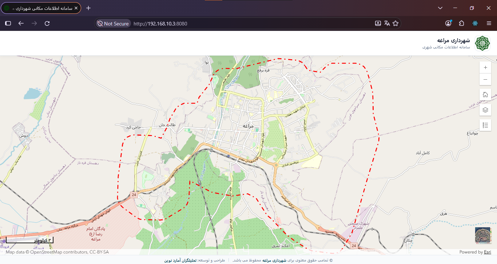
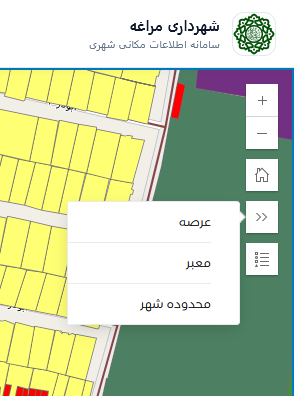
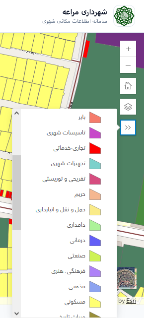
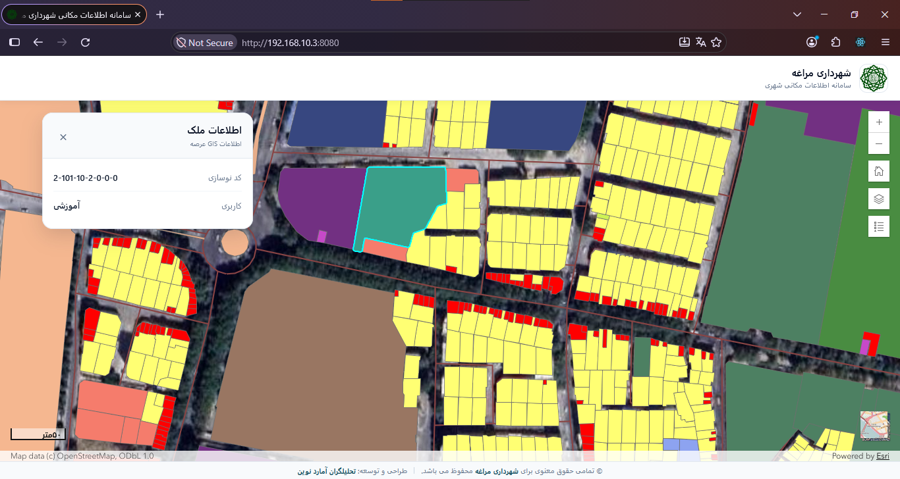

# Municipal WebGIS Platform

A modern municipal WebGIS platform built with **React, TypeScript, Bootstrap 5, and ArcGIS Maps SDK for JavaScript**.

The project provides a reusable foundation for municipal GIS applications, focusing on property information, municipal layers, map interaction, search, and production deployment through IIS and an ArcGIS Server reverse proxy.

**Current version:** `v0.1.0`  
**Status:** Stable MVP

## Demo


## Screenshots

### Main Map


### Layer List


### Layer Legend


### Property Information


## Overview

Municipal WebGIS Platform is an interactive map-based application for accessing and visualizing municipal GIS information.

The current MVP integrates ArcGIS services with a React-based frontend and provides a foundation for future backend APIs, authentication, advanced spatial analysis, reporting, and multi-municipality configuration.

## Features

- Interactive ArcGIS map
- Municipal GIS layer visualization
- Property identification and information
- Property search using `Code_nosazi`
- Layer visibility management
- Layer legend
- Custom satellite imagery basemap
- Basemap switching
- Home navigation
- Scale bar
- Responsive Bootstrap 5 UI
- Persian RTL interface
- Notification and error handling
- Environment-based GIS configuration
- IIS deployment
- ArcGIS Server reverse proxy integration

See [Features](docs/features.md).

## Architecture

```text
┌─────────────────────────────┐
│         Web Browser         │
│                             │
│ React + TypeScript          │
│ Bootstrap 5                 │
│ ArcGIS Maps SDK             │
└──────────────┬──────────────┘
               │
               │ /arcgis/*
               ▼
┌─────────────────────────────┐
│        IIS Web Server       │
│                             │
│ Static React Application    │
│ URL Rewrite / Reverse Proxy │
└──────────────┬──────────────┘
               │
               ▼
┌─────────────────────────────┐
│        ArcGIS Server        │
│ FeatureServer / MapServer   │
│ ImageServer                 │
└─────────────────────────────┘
```

See [Architecture Overview](docs/architecture-overview.md).

## Technology Stack

| Area | Technology |
|---|---|
| Frontend | React |
| Language | TypeScript |
| Build Tool | Vite |
| UI | Bootstrap 5 |
| GIS | ArcGIS Maps SDK for JavaScript |
| ArcGIS Components | ArcGIS Map Components / Calcite Components |
| Font | Vazirmatn |
| Web Server | IIS |
| Reverse Proxy | IIS URL Rewrite / ARR |
| GIS Server | ArcGIS Server |
| Version Control | Git / GitHub |

## Project Structure

```text
municipal-webgis-platform/
├── src/
│   ├── app/
│   ├── components/
│   ├── config/
│   ├── hooks/
│   ├── types/
│   ├── App.tsx
│   ├── main.tsx
│   └── index.css
├── public/
├── docs/
│   ├── screenshots/
│   ├── architecture-overview.md
│   └── features.md
├── .env.example
├── package.json
├── vite.config.ts
└── README.md
```

## Configuration

ArcGIS service URLs are managed through environment variables.

Example:

```env
VITE_ARCGIS_IMAGERYLAYER_URL=
VITE_ARCGIS_MAPSERVER_URL=
VITE_ARCGIS_FEATURESERVER_URL=
```

Use `.env.example` as the template.

> `VITE_*` variables are frontend configuration values. They must not contain passwords, API secrets, or other sensitive credentials.

## Development

```bash
npm install
npm run dev
```

Build:

```bash
npm run build
```

Preview:

```bash
npm run preview
```

## Deployment

The current production model uses IIS for hosting the React application and reverse proxying ArcGIS requests.

```text
Browser
   │
   ▼
IIS
   │
   ├── React static files
   │
   └── /arcgis/*
           │
           ▼
      ArcGIS Server
```

The browser uses `/arcgis/...` paths in production rather than exposing the internal ArcGIS Server address directly.

## Git Workflow

The repository uses three main branches:

```text
master
develop
deploy
```

- `master` — stable project history and release baseline
- `develop` — active development, features, bug fixes, and refactoring
- `deploy` — production-ready version used for deployment

Releases are versioned using Git tags such as:

```text
v0.1.0
```

## Roadmap

- Multi-municipality configuration
- Runtime application configuration
- Advanced property search
- Measurement tools
- Printing
- Buffer / Intersect / Nearest / Spatial Join / Distance
- ASP.NET Core Web API
- SQL Server integration
- Authentication and authorization
- Municipal reporting
- Dashboard and statistics
- Deployment automation

## Versioning

The project follows Semantic Versioning:

```text
MAJOR.MINOR.PATCH
```

Current release:

```text
v0.1.0
```

This release represents the first stable MVP.

## License

License information will be added when the project's distribution and usage model is finalized.
